# UML Diagrammen - Avans DevOps
## Software Ontwerp & Architectuur 3

**Project**: Avans DevOps - Scrum/DevOps Project Management System  
**Student**: [Naam]  
**Datum**: 2025  
**Versie**: 1.0

---

## Inhoudsopgave
1. [Class Diagrams](#1-class-diagrams)
2. [State Diagrams](#2-state-diagrams)
3. [Sequence Diagrams](#3-sequence-diagrams)
4. [Design Pattern Diagrams](#4-design-pattern-diagrams)

---

## Hoe PlantUML Diagrammen Gebruiken

### Online Rendering
Bezoek: http://www.plantuml.com/plantuml/uml/
Plak de code en klik op "Submit" voor een PNG afbeelding.

### VS Code Extension
Installeer: "PlantUML" extension door jebbs
Druk op `Alt+D` om preview te zien.

### Lokaal met Java
```bash
java -jar plantuml.jar diagram.puml
```

---

## 1. Class Diagrams

### 1.1 Overall Domain Model

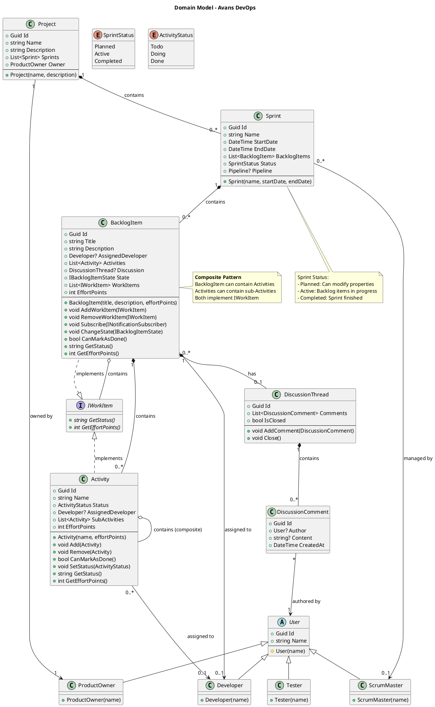

---

### 1.2 Pipeline & Actions

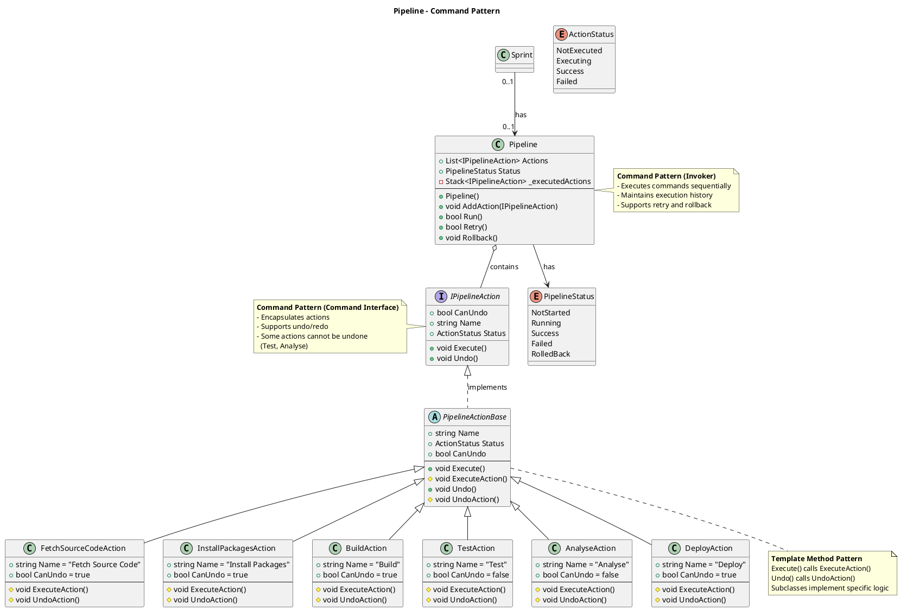

---

### 1.3 Sprint Report & Export

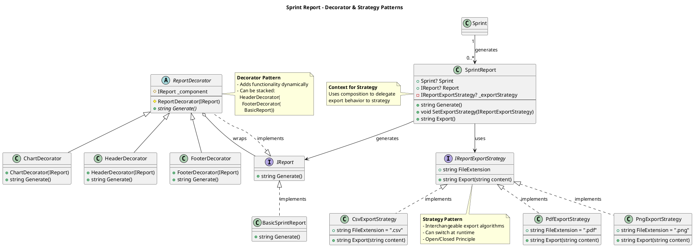

---

## 2. State Diagrams

### 2.1 BacklogItem State Machine

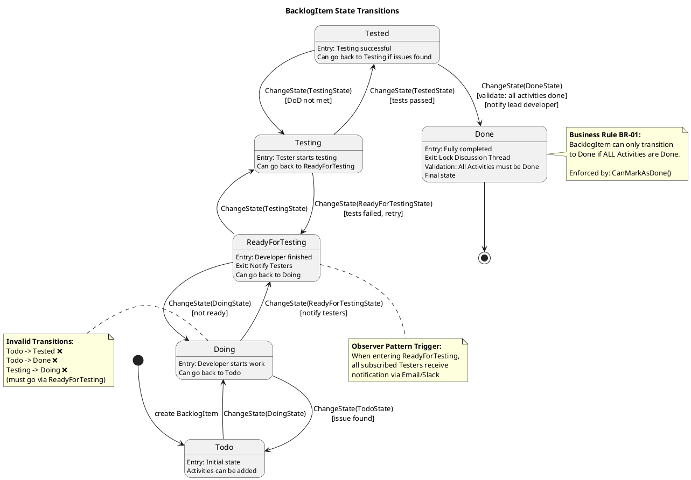

---

### 2.2 Sprint Lifecycle State Diagram

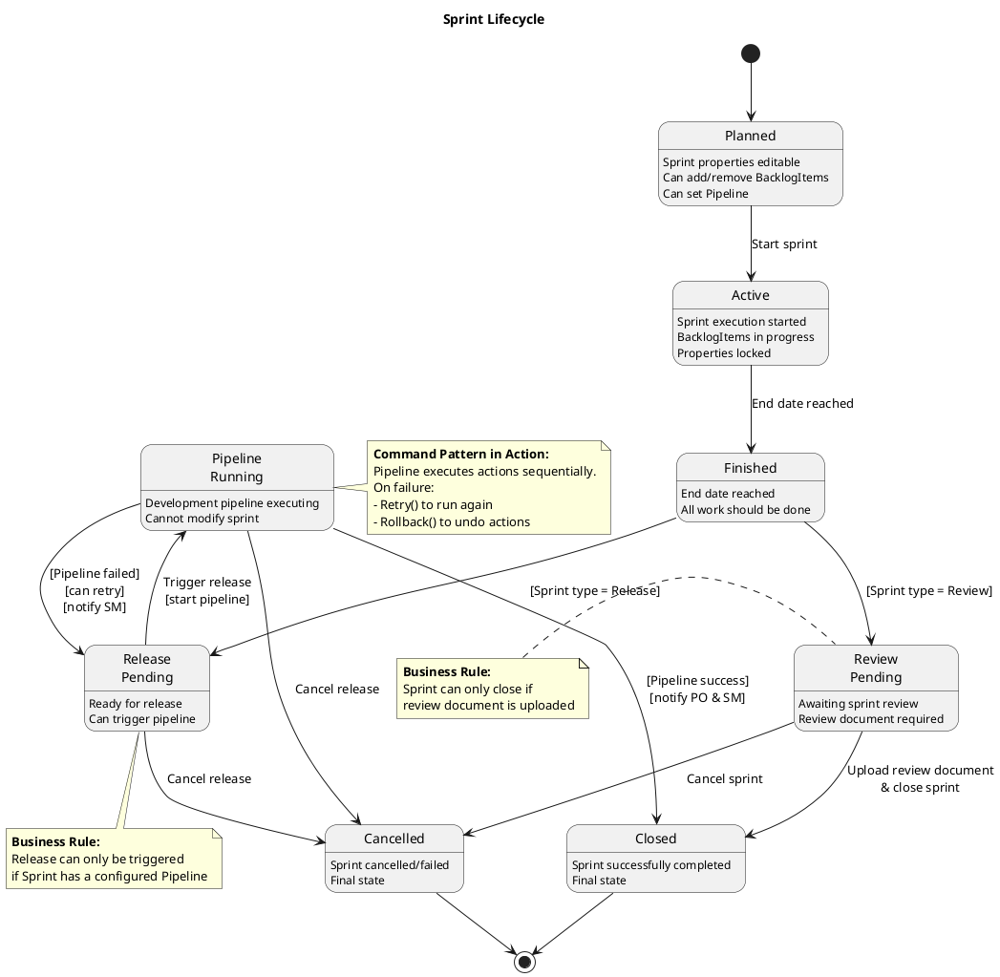

---

### 2.3 Activity Status State Diagram

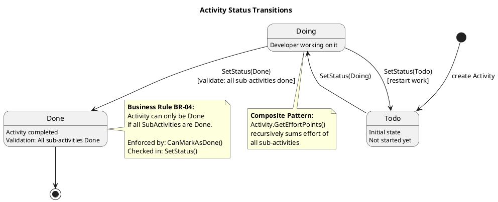

---

## 3. Sequence Diagrams

### 3.1 BacklogItem State Change with Notification

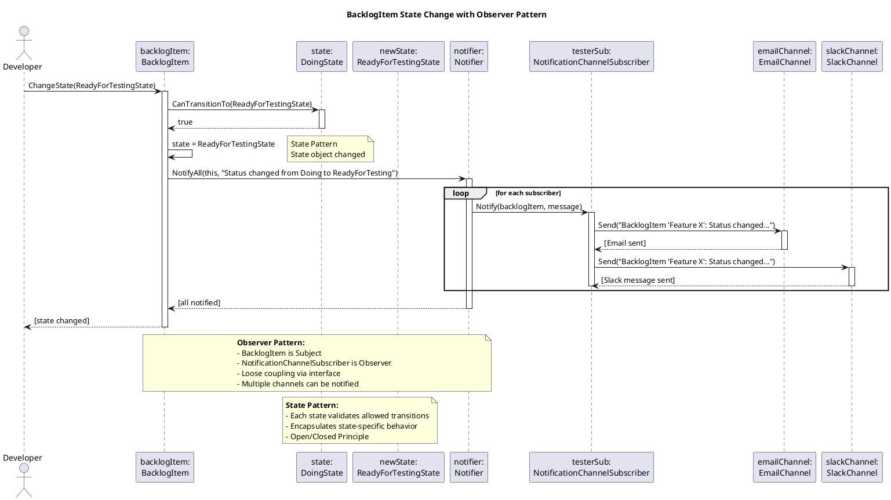

---

### 3.2 Pipeline Execution with Rollback

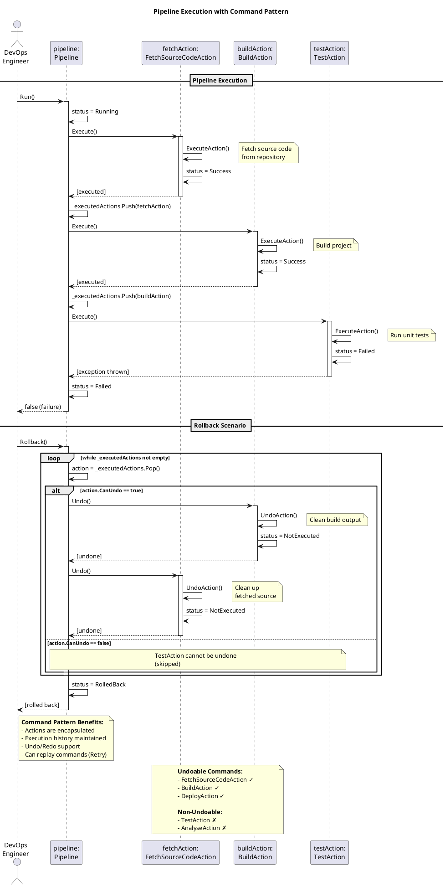

---

### 3.3 Report Generation with Decorator and Strategy

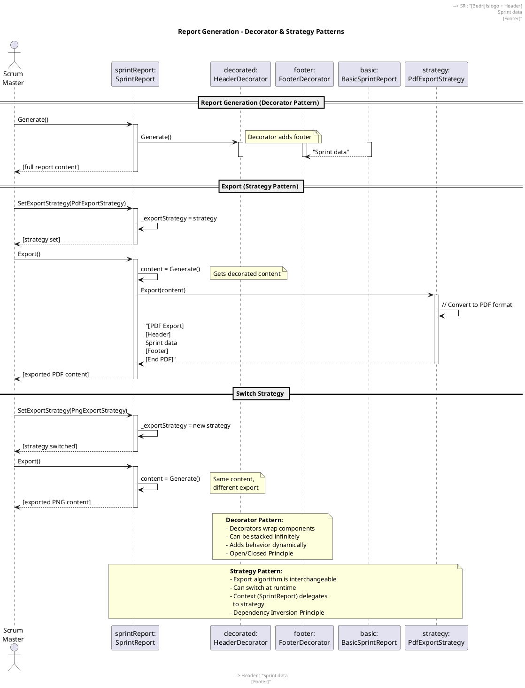

---

### 3.4 Composite Pattern - Recursive Effort Points Calculation

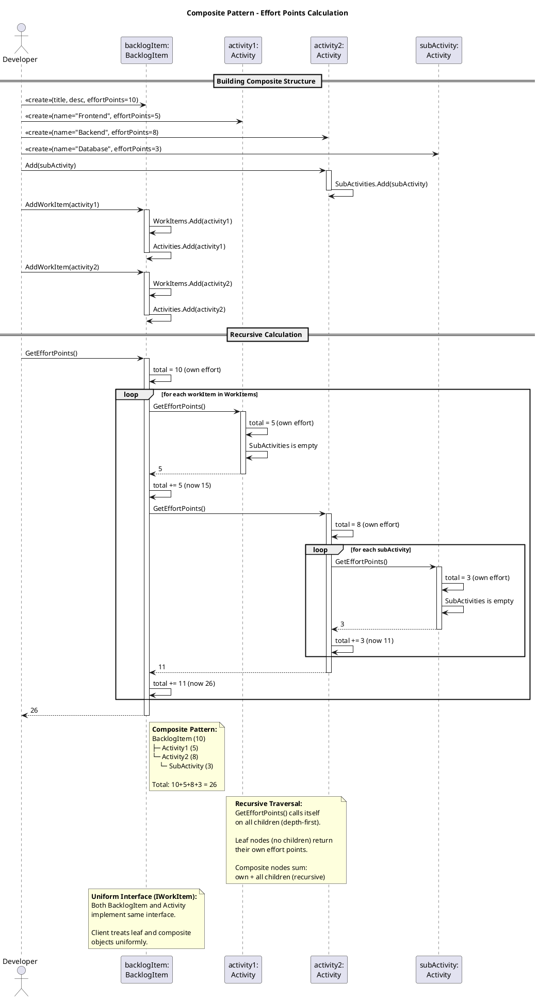

---

## 4. Design Pattern Diagrams

### 4.1 State Pattern - Detailed

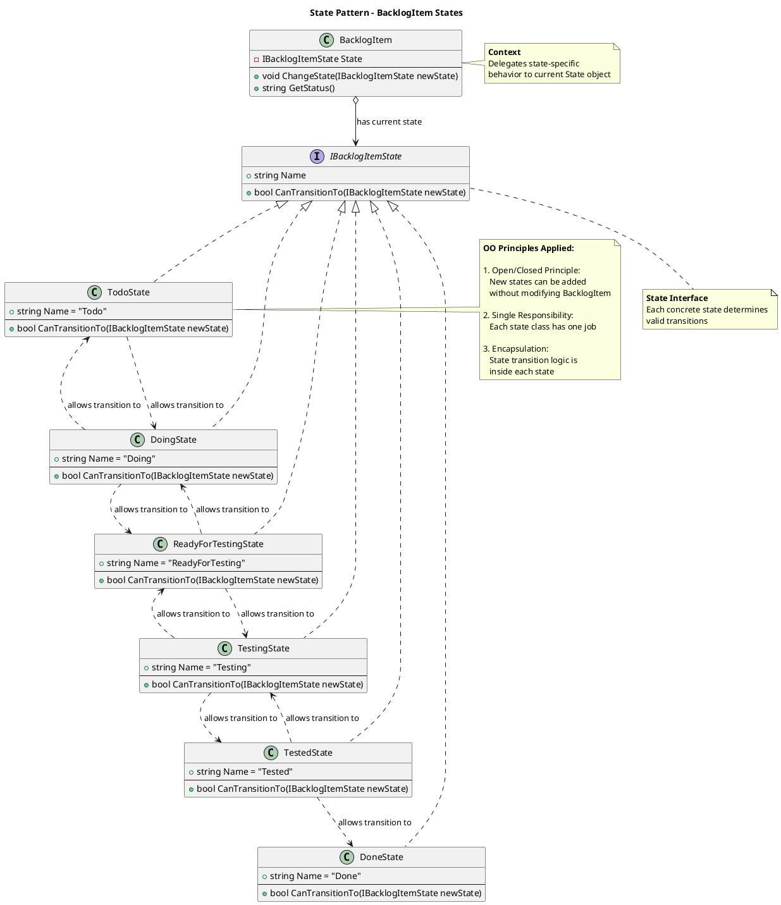

---

### 4.2 Observer Pattern - Detailed

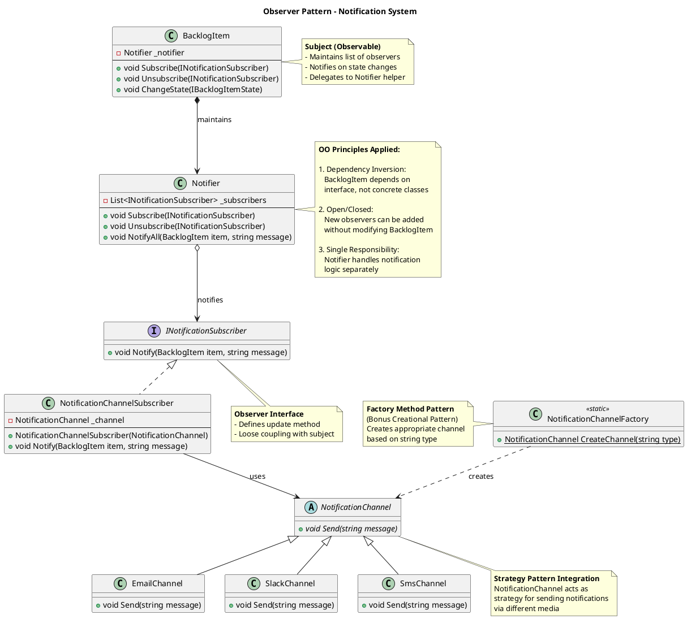

---

### 4.3 Composite Pattern - Detailed

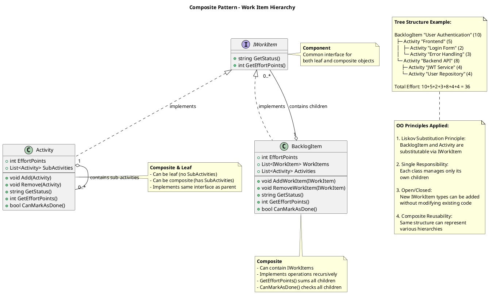

---

### 4.4 All Patterns Integration Overview

```plantuml
@startuml All_Patterns_Integration
!define TITLE Design Patterns Integration Overview

title TITLE

package "Domain Model" {
    class BacklogItem {
        Uses: State, Observer, Composite
    }
    
    class Activity {
        Uses: Composite
    }
    
    class Pipeline {
        Uses: Command
    }
    
    class SprintReport {
        Uses: Decorator, Strategy
    }
}

package "State Pattern" {
    interface IBacklogItemState
    class TodoState
    class DoingState
    class DoneState
}

package "Observer Pattern" {
    interface INotificationSubscriber
    class Notifier
    class NotificationChannelSubscriber
}

package "Composite Pattern" {
    interface IWorkItem
}

package "Command Pattern" {
    interface IPipelineAction
    class PipelineActionBase
    class BuildAction
    class DeployAction
}

package "Decorator Pattern" {
    interface IReport
    class ReportDecorator
    class HeaderDecorator
}

package "Strategy Pattern" {
    interface IReportExportStrategy
    class PdfExportStrategy
    class PngExportStrategy
}

BacklogItem --> IBacklogItemState : uses
BacklogItem --> Notifier : uses
BacklogItem ..|> IWorkItem : implements
Activity ..|> IWorkItem : implements

Pipeline --> IPipelineAction : uses
PipelineActionBase ..|> IPipelineAction : implements
BuildAction --|> PipelineActionBase : extends

SprintReport --> IReport : uses
SprintReport --> IReportExportStrategy : uses
ReportDecorator ..|> IReport : implements
HeaderDecorator --|> ReportDecorator : extends
PdfExportStrategy ..|> IReportExportStrategy : implements

note right of BacklogItem
  **Integration Point:**
  BacklogItem uses 3 patterns:
  - State: for status transitions
  - Observer: for notifications
  - Composite: for activities
end note

note bottom of SprintReport
  **Integration Point:**
  SprintReport combines 2 patterns:
  - Decorator: for content
  - Strategy: for export format
end note

note left of Pipeline
  **Command Pattern:**
  Pipeline acts as Invoker
  for executing, undoing, and
  retrying pipeline actions
end note

@enduml
```

---

## 5. UML Diagram Export Instructions

### 5.1 Voor PDF Inlevering

**Stap 1: Render alle diagrammen**
1. Kopieer elke PlantUML code block
2. Ga naar: http://www.plantuml.com/plantuml/uml/
3. Plak code en klik "Submit"
4. Klik rechts op afbeelding → "Save image as..."
5. Sla op als PNG met beschrijvende naam

**Stap 2: Voeg toe aan document**
- Voeg alle PNG bestanden toe aan je PDF document
- Organiseer per sectie (Class, State, Sequence)
- Voeg toelichting toe onder elk diagram

### 5.2 Voor Live Editing in VS Code

**Install PlantUML Extension:**
```
1. Open VS Code
2. Ga naar Extensions (Ctrl+Shift+X)
3. Zoek "PlantUML" door jebbs
4. Installeer de extensie
5. Install Java JRE (required)
```

**Preview Diagram:**
```
1. Open dit .md bestand in VS Code
2. Plaats cursor in PlantUML code block
3. Druk Alt+D voor preview
4. Of: Ctrl+Shift+P → "PlantUML: Preview Current Diagram"
```

**Export from VS Code:**
```
Ctrl+Shift+P → "PlantUML: Export Current Diagram"
Kies formaat: PNG, SVG, PDF
```

---

## 6. Design Rationale

### 6.1 Waarom deze UML Diagrammen?

| Diagram Type | Rationale |
|--------------|-----------|
| **Overall Domain Model** | Toont complete structuur en relaties tussen entities |
| **Pipeline Class Diagram** | Illustreert Command Pattern implementatie in detail |
| **Report Class Diagram** | Toont interactie tussen Decorator en Strategy patterns |
| **BacklogItem State Diagram** | Visualiseert complexe state machine met business rules |
| **Sprint Lifecycle** | Toont sprint flow inclusief pipeline execution |
| **State Change Sequence** | Demonstreert Observer Pattern in actie |
| **Pipeline Execution Sequence** | Toont Command Pattern met undo/retry |
| **Report Generation Sequence** | Toont samenwerking Decorator + Strategy |
| **Composite Sequence** | Illustreert recursieve operaties in boom-structuur |

### 6.2 OO Principes per Pattern

**State Pattern:**
- ✅ Open/Closed: Nieuwe states zonder bestaande code te wijzigen
- ✅ Single Responsibility: Elke state één verantwoordelijkheid
- ✅ Liskov Substitution: Alle states uitwisselbaar

**Observer Pattern:**
- ✅ Dependency Inversion: Afhankelijk van abstractie
- ✅ Open/Closed: Nieuwe observers toevoegen zonder wijzigingen
- ✅ Single Responsibility: Notifier gescheiden van domain logic

**Command Pattern:**
- ✅ Single Responsibility: Elke command één actie
- ✅ Open/Closed: Nieuwe commands toevoegen
- ✅ Command Query Separation: Execute vs query methods

**Strategy Pattern:**
- ✅ Open/Closed: Nieuwe strategies toevoegen
- ✅ Dependency Inversion: Context afhankelijk van interface
- ✅ Liskov Substitution: Alle strategies uitwisselbaar

**Composite Pattern:**
- ✅ Liskov Substitution: Uniform treatment leaf/composite
- ✅ Single Responsibility: Elk niveau eigen kinderen
- ✅ Open/Closed: Nieuwe IWorkItem types toevoegen

**Decorator Pattern:**
- ✅ Open/Closed: Nieuwe decorators toevoegen
- ✅ Single Responsibility: Elke decorator één decoratie
- ✅ Liskov Substitution: Decorators uitwisselbaar

---

**Document Versie**: 1.0  
**Laatste Update**: 2025  
**Status**: Ready for Export to PDF
